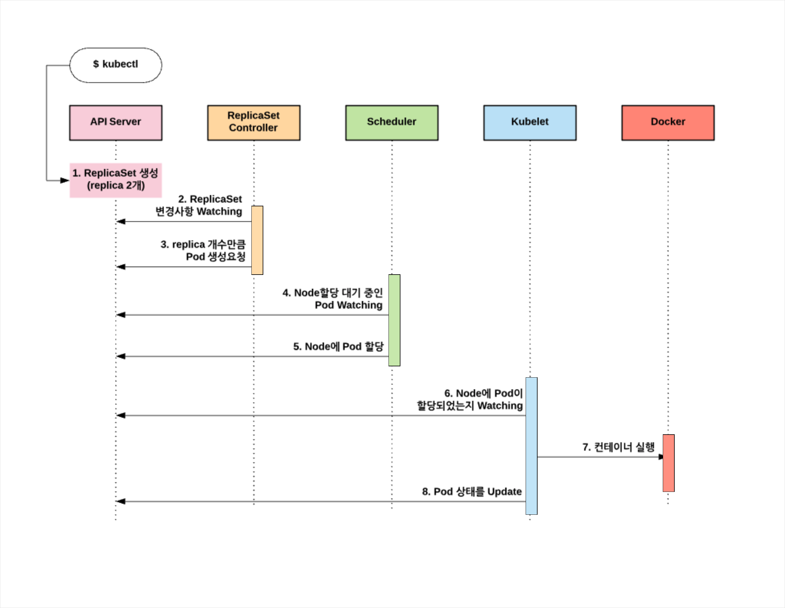

## 도커

도커는 컨테이너형 가상화 기술을 구현하기 위한 상주 어플리케이션과 이 어플리케이션을 조작하기 위한 명령행 도구로 구성되는 프로덕트이다

어플리케이션 개발 및 운영을 컨테이너 중심으로 할 수 있다

몇 줄짜리 구성파일(Dockerfile)과 명령어 한 줄로 어플리케이션, 미들웨어가 이미 갖춰진 테스트용 가상환경(도커 컨테이너)를 빠르게 구축할 수 있다

**뛰어난 이식성** : 개발환경과 운영환경의 동등 재현 가능


**컨테이너 가상화 기술**

가상화 소프트웨어 없이 운영체제의 리소스를 격리해 가상 운영 체제로 만들 수 있다

호스트 운영체제는 구조적으로 오버헤드가 크가




### 도커 맛보기

```sh
#!/bin/sh

echo "hello, world!"
```

Docker Image Build : 도커파일이나 어플리케이션 실행파일을 사용하여 도커 컨테이너의 원형 이미지 만드는 과정

FROM : 운영체제를 정의

COPY : 바로 위의 셸 스크립트 파일을 도커 컨테이너 안의 /usr/local/bin에 복사

RUN : 도커 컨테이너 안의 어떤 명령을 수행 -> 실행권한 부여하는 예제

CMD : 완성된 이미지를 도커 컨테이너로 실행전에 먼저 실행할 명령 정의 -> 어플리케이션 실행 예제

```docker
FROM ubuntu:16.04

COPY helloworld /usr/local/bin
RUN chmod +x /usr/local/bin/helloworld

CMD ["helloworld"]
```


`docker image bulid -t helloworld:latest` : 이미지를 빌드하고 실행

`docker container run helloworld:latest` :빌드후 컨테이너를 실행

-> 우분투 운영체제와 함께 컨테이너로 실행


