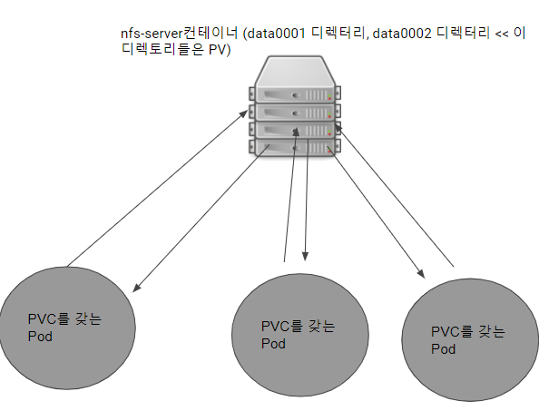
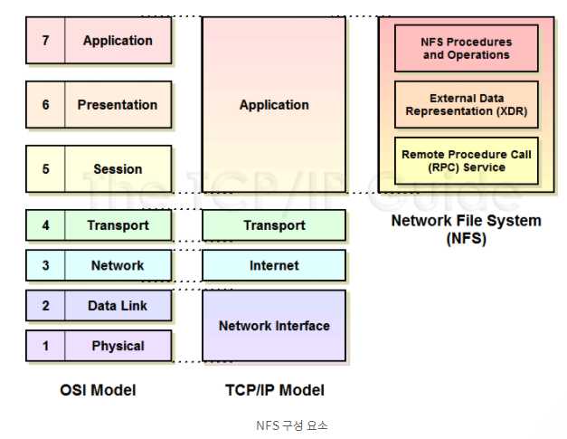

### Probe

[프로브](https://kubernetes.io/docs/reference/generated/kubernetes-api/v1.20/#probe-v1-core)는 컨테이너에서 [**kubelet**](https://kubernetes.io/docs/reference/command-line-tools-reference/kubelet/)에 의해 주기적으로 수행되는 진단(diagnostic)이다. kubelet은 실행 중인 컨테이너들에 대해서 선택적으로 세 가지 종류의 프로브를 수행하고 그에 반응할 수 있다.

**livenessProbe**: 컨테이너가 **동작 중인지 여부**를 나타낸다. 만약 활성 프로브(liveness probe)에 실패한다면, kubelet은 컨테이너를 죽이고, 해당 컨테이너는 [**재시작 정책**](https://kubernetes.io/ko/docs/concepts/workloads/pods/pod-lifecycle/#restart-policy)의 대상이 된다. 

**readinessProbe**: 컨테이너가 **요청을 처리할 준비가 되었는지 여부**를 나타낸다. 만약 준비성 프로브(readiness probe)가 실패한다면, 엔드포인트 컨트롤러는 파드에 연관된 모든 서비스들의 엔드포인트에서 **파드의 IP주소를 제거**한다. 

**startupProbe**: 컨테이너 내의 **애플리케이션이 시작되었는지**를 나타낸다. 스타트업 프로브(startup probe)가 주어진 경우, 성공할 때까지 다른 나머지 프로브는 활성화되지 않는다. 

  

## **Running Stateful Services on Kubernetes**

**Learn how to run stateful services on Kubernetes**

### 시나리오

- **Persistent Volume(PV) 만들기(NFS 이용)**

- **Persistent Volume Claim(PVC) 만들기**

- **PV와 PVC 매핑하기**

- **PV에 작성된 데이터 확인하기**

  - PV에 변경된 데이터 확인

  - 작성된 데이터를 다른 파드에서 확인

   

### 개념이해

볼륨은 쿠버네티스의 디스크 서비스이다

시스템 관리자는 실제 물리 디스크 생성 후 이 디스크를 PersistentVolume이라는 이름으로 쿠버네티스에 등록

개발자는 Pod를 생성할때, 볼륨을 정의하고, 이 볼륨 정의 부분에 물리적 디스크에 대한 특성을 정의하는 것이 아니라 PVC를 지정하여, 관리자가 생성한 PV와 연결

시스템 관리자가 생성한 **물리 디스크를 쿠버네티스 클러스터에 표현한것이 PV**이고, **Pod의 볼륨과 이 PV를 연결하는 관계가 PVC**가 된다

**NFS 프로토콜(Network File System Protocol)**

클라이언트가 네트워크 상에 있는 파일을 접근할 때 사용하는 프로토콜

클라이언트 호스트가 원격 서버에 마치 로컬 파일 처럼 접근하기 위해 개발

구조적으로 TCP/IP 어플리케이션 계층에 존재

- **작동원리**
  - NFS 데몬을 실행하는 마스터 노드를 사용해서 데이터를 조작
  - 클라이언트는 드라이브 마운트를 통해 공유된 마스터에 접근
  - 애플리케이션 관점에선 로컬 디스크에 쓰는 것처럼 보인다
  - 내부적으로는 NFS 프로토콜이 마스터 노드에 데이터를 쓴다.

- **단점** : 전체적인 파일을 같이 공유 하기 때문에 보안에는 취약점이 존재한다.

 

 

