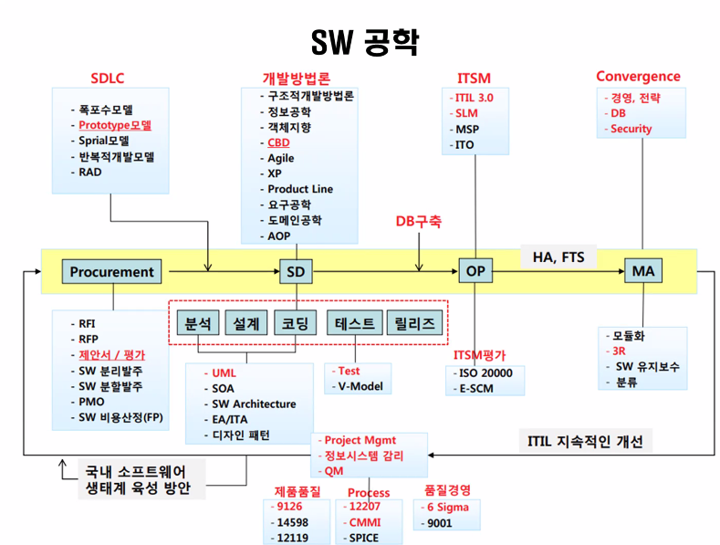

## 데브옵스 및 클라우드 기초

협업툴 : JIRA

코딩협업 : Git

테스트 : Jenkins

**AWS EKS**, EC2, S3 ...

### 데브옵스 툴체인

**데브옵스 툴체인**(DevOps toolchain)은 데브옵스(DevOps) 적용이 가능한 툴을 묶어 하나의 체인 형식으로 모든 과정(기획-개발-빌드-테스트-배포-모니터링-산출물-KnowledgeBase)을 묶어 사용하는 개념이다. 데브옵스 문화를 효과적으로 적용하기 위한 방법론이다.

 

1. 코드 - 코드 개발 및 검토, 버전 관리 도구, 코드 병합
2. 빌드 - 지속적 통합(CI) 도구, 빌드 상태
3. 테스트 - 테스트 및 결과가 성능을 결정
4. 패키지 - 애플리케이션 디플로이 이전 단계
5. 릴리스 - 변경사항 관리, 릴리스 승인, 릴리스 자동화
6. 구성 - 인프라스트럭처 구성 및 관리, IaC(Infrastructure as Code) 도구
7. 모니터링 - 애플리케이션 성능 모니터링, 최종 사용자 경험.

### 데브옵스

소통, 협업, 통합 및 자동화를 강조하는 소프트웨어 개발 환경이나 문화

소프트웨어 개발 조직과 운영 조직간의 상호 의존적 대응

### Docker

windows 10 pro 부터는 docker 설치가능

**도커허브 dockerhub**

이미지 업로드는 가입이 필요

**설치순서**

docker pull ubuntu

docker run -it --name ubuntu_os ubuntu:latest