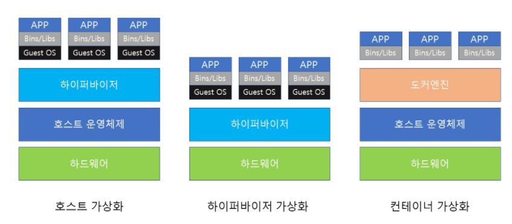
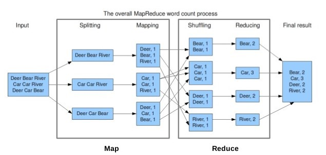
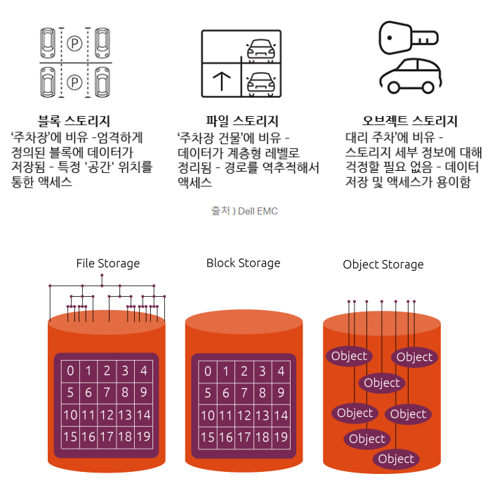
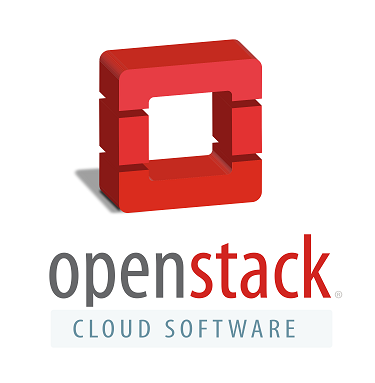

## 클라우드의 기술들

### 미들웨어

클라우드 인프라의 확산으로 미들웨어의 중요성이 커지고 있다

개발자들의 부담을 줄여준다

### IaaS PaaS SaaS

**IaaS (=Infrastructure as a Service)**

IaaS는 서버, 스토리지, 네트워크 등과 같은 하드웨어 인프라 자원만을 제공하는 서비스를 의미

IaaS를 제공받아 사용하는 사용자는 OS를 직접 설치하고 원하는 플랫폼 및 프레임워크를 직접 설치하여 개발한
어플리케이션을 서비스할 수 있습니다.
그러나 여전히 개발자의 입장으로서는 어플리케이션 개발을 위해 해야할 작업이 많다는 아쉬움이 있습니다.

대표적으로 아마존의 Amazon Web Service가 가장 유명하고 외에도 Microsoft, Oracle, IBM 등의 기업에서도
IaaS를 제공하고 있습니다. 오픈소스로는 OpenStack이 가장 유명

**PaaS (=Platform as a Service)**

PaaS는 어플리케이션을 개발하고 서비스하기 위해서 필요한 운영체제, 개발 환경 플랫폼, 개발 언어 프레임워크 등을 자동화하여 설치 및 제공함으로써 개발자들이 어플리케이션을 개발하는 것에만 집중할 수 있도록하는 플랫폼을 제공하는 서비스

 개발자들의 입장에서는 이미 운영체제, 데이터베이스, 웹서버, WAS, 언어 프레임워크 등 개발에 필요한 모든 것이 이미 설치되어있고 설정이 끝나있는 상태이기에 어플리케이션을 개발하기가 수월해지고 시간도 단축되는 등의 많은 이점이 있습니다.
그러나 반면에 이 점이 단점이 되기도 하는데, 한 번 제공받아 구축된 환경에서 개발 및 서비스하므로 특정 플랫폼에 종속되는 결과를 낳기도 합니다. **플랫폼 이식성이 굉장히 떨어진다는 것**은 사전에 인지를 하고 있어야 합니다.

대표적으로 Google App Engine이나 Force.com이 PaaS로 제공되고 있습니다. 오픈소스로는 OpenShift나 Cloud Foundry가 유명합니다.

**SaaS (=Software as a Service)**

사용자는 브라우저를 통해 별도의 프로그램을 설치하지 않아도 서비스를 제공

대표적인 예로 구글의 Gmail, 네이버의 N클라우드, 구글의 Google Drive, Dropbox 등이 SaaS에 해당하고 ERP나 CRM도 SaaS의 형태로 많이 제공되고 있습니다.

### 서버 가상화 기술

**서버가상화**

- 하나의 물리적 서버 리소스에 있는 하드웨어를 논리적으로 나누어 여러개의 가상 서버에 할당
- 공간절약과 비용 절감

### 

- 하이퍼바이저 형
  - 하나의 물리 서버 하드웨어 위에 하이퍼바이저라는 가상화 소프트웨어를 동작 그위에 여러개의 게스트 OS를 가동
  - VM웨어의 VMware vSpherer, 마이크로소프트의 Hyper-V, 시트릭스의 Xen 
- 호스트 OS형
  - 하드웨어 위 기본이 되는 호스트의 운영체제 설치하고 호스트 운영체제에 가상화 소프트웨어 설치
  - 가상의 하드웨를 에뮬레이팅 하는 방식, 오버헤드가 클 수 있다
  - VM Workstation, VMWare Server, Virtual Box 등
- 컨테이너형
  - 호스트 OS 위에 컨테이너 관리 소프트웨어를 설치, 논리적으로 컨테이너를 나누어 사용
  - 어플리케이션 동작을 위한 라이브러리와 어플리케이션으로 구성되어 각각 개별 서버처럼 사용
  - 오버헤드가 적고 빠르다
  - 어플리케이션 실행환경이 컨테이너 단위라서 클라우드 간의 복제와 이식이 쉽다
  - Docker

`하이퍼바이저`

- **하이퍼바이저**는 호스트 컴퓨터(Host Computers) 한 대에서 운영체제 다수를 동시에 실행하는 논리적 플랫폼을 말한다. 가상 머신 모니터(Virtual Machine Monitor)
- 하이퍼바이저는 하드웨어에 직접 설치해서 실행되는 Native(또는 베어메탈) 방식과 일반 애플리케이션처럼 프로그램으로 설치되는 Hosted 방식으로 분류한다.

**Native (또는 베어메탈) 방식**

- Native 방식의 하이퍼바이저는 해당 하드웨어에 직접 설치해서 실행됩니다. 그러면 게스트 운영체제는 이미 하드웨어에 설치된 하이퍼바이저에서 두 번째 수준으로 실행됩니다.
- 즉 하드웨어 운영체제 대신 Xen, KVM, Xen Server 같은 하이퍼바이저를 설치하고 설치된 하이퍼바이저 위에 Linux, Window등 다른 운영체제가 실행되는 방식입니다.

**Hosted 방식**

- Hosted 방식의 하이퍼바이저는 일반 프로그램처럼 호스트 운영체제에서 실행되며, 가상 머신 안에서 동작되는 게스트 운영체제는 하드웨어에서 세 번째 수준으로 실행됩니다.
- 윈도우, 리눅스, 맥 등 피시에 VirtualBox나 VMware를 설치하고 다른 운영체제를 띄우는 것을 Hosted 방식의 하이퍼바이저라고 합니다.

[[Open Stack\]오픈스택을 다루는 기술 1장 정리 (velog.io)](https://velog.io/@yujo/Open-Stack오픈스택을-다루는-기술-1장-정리)

### 분산처리 기술

분산처리 기술과 클라우드 서비스를 이용하여 데이터를 여러 서버에 나누어 병렬로 처리가 가능하다

- 클러스터링
  - 대량의 데이터를 분산처리하는 장치
  - 여러 개의 서버를 결합하여 하나의 컴퓨터로 보이게 한다
  - 장애가 발생해도 다른 서버에서 자동으로 작업을 할당
- Apache Hadoop
  - 1대의 마스터 서버와 여러 대의 슬레이브 서버로 구성
  - 마스터가 데이터 처리 전체를 제어, 슬레이브 서버가 계산처리
  - 대용량 데이터의 일괄 처리에 적합
- Apache Spark
  - 메모리 안의 대량의 데이터를 병렬 분산 처리
  - 하둡은 디스크에 데이터를 읽고 쓰는 반면 Spark는 메모리에서 읽고 쓰므로 속도가 매우 빠르다
  - 테라바이트 이상의 크기의 데이터 처리에는 부적합
  - 인종지능 및 데이터 반복 처리하는 고급 데이터 분석에 적합

`맵 리듀스` : 대용량 데이터를 처리하기 위한 분산 프로그래밍 모델

- **대용량의 데이터 처리를 위한 분산 프로그래밍 모델**, 소프트웨어 프레임워크
- 맵리듀스 프레임워크를 이용하면 대규모 분산 컴퓨팅 환경에서, 대량의 데이터를 병렬로 분석 가능합니다.
- 프로그래머가 직접 작성하는 **맵**과 **리듀스** 라는 두 개의 메소드로 구성됩니다.
  - 맵(Map) : 흩어져 있는 데이터를 연관성이 있는 데이터를로 분류합니다. (key-value)
  - 리듀스(Reduce) : Map에서 출련된 데이터에서 중복 데이터를 제거하고 원하는 데이터를 추출합니다.

#### 

### 데이터베이스 기술

- RDS(관계형 데이터 베이스)

  - 여러 개의 데이터를 행과 열이 있는 표 형식으로 표현
  - RDBMS라는 전용 소프트웨어로 관리한다

  

- NoSQL

  - Not only SQL, 즉 SQL만을 사용하지 않는 데이터베이스 관리 시스템
  - 자료구조가 다양
  - 스키마구조가 없다

  - 키 밸류 형 : 모든 데이터는 인덱싱 값으로 구성, 구성이 간단하고 확장성이 높다, 읽기 속도가 빠르다
    - dynamoDB, Redis
  - 컬럼 형 : 열 단위로 데이터를 보관하고 대량의 컬럼 단위 데이터 집계, 갱신이 빠르고 쓰기 속도 빠르다
    - Hbase, Cassandra
  - 문서지향 형 : 복잡한 데이터를 문서에 저장하고 문서 단위로 처리
    - MongoDB, CouchDB
  - 그래프 형 : 데이터 간의 관계를 그래프로 표현
    - Neo4J

`인덱싱(indexing)`: 데이터베이스에 색인을 남기는 것으로, 어떤 데이터가 어디에 있다는 위치 정보를 제공하여 검색 속도를 높이는 기술

### 스토리지 기술

**블록스토리지**

- 일정 크기의 블록이라는 개별 단위로 분할
- 각 블록은 저장된 위치에 대한 고유한 주소가 있어 서버에서 파일을 요청하면 블록을 재구성해 하나의 데이터로 서버에 연결한다
- 스토리지 엑세스에는 파이버 채널(FC), iSCSI와 같은 전용 프로토콜을 사용

**파일 스토리지**

- 파일 단위로 저장 액세스가 가능
- 파일 공유 기능을 갖추었다
- 윈도우에는 SMB, CIFS, 리눅스에는 NFS와 같은 파일 공유 프로토콜이 사용
- NAS(Network Attached Storage)도 파일 스토리지에 해당된다

**오브젝트 스토리지**

- 데이터를 객체 단위로 처리
- REST( REpresentational State Transfer) 형식의 API 를 사용
- 복잡한 대용량 비정형 데이터의 처리가 효율적
- 대부분의 서비스 백엔드 스토리지로 사용

### IaaS를 위한 오픈 소스 클라우드 기반

**OpenStack**

- IaaS 형태의 클라우드 컴퓨팅 오픈 소스
- 아파치 라이선스 2.0
- 서버, 스토리지, 네트워크와 같은 물리자원을 가상화시켜 대시보드 및 REST API로 제공하고 이를 관리할 수 있는 IaaS 클라우드 플랫폼 구축용 오픈소스
- 하이퍼바이저 오버 제어 및 서버 가상화의 기능을 가진 Nova, 네트워크를 가상화하는 Neutron, 운영 관리 도구인 Horizon 등 여러 개의 소프트웨어로 구성

**오픈스택의 주요 특징**

- **Lock-in 방지** : 아파치 2.0 라이센스로 특정 벤더에 종속되는 Lock-in 현상방지
- **기능개선 및 공유** : Open Community를 기반으로 전세계 엔지니어들간의 상호협력으로 빠른 기능개선, 공유
- **클라우드간 이동이 자유로움** : Publick / Private / Hybrid 형태의 클라우드 서비스 제공이 가능한 소프트웨어로 클라우드 간의 이동이 자유로움
- **산업표준** : 구현 기술에 독립적인 클라우드 컴퓨팅 플랫폼 산업 표준 수립 목적

`아파치 라이선스 2.0`

GPL과는 달리 소스 코드 공개의 의무가 존재하지 않고, 2차 라이선스와 변형물의 특허 출원이 가능. 라이선스 적용 시 아파치 재단의 이름과 라이선스의 내용을 명시해야 하며, 아파치 라이선스 2.0이 적용된 소스 코드를 수정했을 경우 외부에 그 사실을 밝혀야 한다.

`REST`

`Representational State Transfe`라는 용어의 약자이다.
자원을 `URI`로 표시하고 해당 자원의 상태를 주고 받는 것을 의미

REST의 구성 요소는

- `자원(Resource): URI`
- `행위(Verb): HTTP METHOD`
- `표현(Representations)`
  로 이루어져 있다.

즉 `Rest`는 `URI`를 통해 자원을 표시하고, `HTTP METHOD(GET, POST, PUT DELETE)`를 이용하여 해당 자원의 행위를 정해주며
그 결과를 받는 것을 말한다.

Rest 기반의 규칙들을 지켜서 설계된 API를 `Rest API` 혹은 `Restful API`이라고 한다.

[REST API와 RESTful API (velog.io)](https://velog.io/@stampid/REST-API와-RESTful-API)

### PaaS를 위한 오픈 소스 클라우드 기반

IaaS와는 독립적으로 동작하며 AWS, VMware, Open Stack과 같은 다양한 클라우드 서비스에서 실행 가능

대표적으로 Cloud Foundry와 Openshift가 있다

**Cloud Foundry**

- VMware가 발표한 오픈 소스 PaaS 기반 소프트웨어

- Ruby로 구현, 다양한 개발언어, 프레임워크, 데이터베이스 지원

  

### 네트워크 가상화 기술

가상화를 통해 시스템을 집약시키면 모든 시스템이 하나의 네트워크와 연결

 목적에 맞게 네트워크를 분할하기 위해 여러 네트워크 카드를 마련하여 가상 머신을 각각 다른 네트워크에 연결시키는 방법이 있음. 이는 결국 성능 향상을 위해 **하드웨어 장비를 또 추가**해야 함을 의미

네트워크 가상화를 사용하면 하나의 네트워크 케이블에 연결되어 있어도 마치 여러 개의 네트워크가 있는 것처럼 처리를 할 수 있어 **가상 머신의 네트워크 통신을 하나의 물리 네트워크로 집약시킬 수 있음**

**VLAN**

- LAN을 가상화 하는 기술

- 하나의 물리적인 네트워크를 여러개의 논리적인 네트워크로 분할

- 논리적으로 분할된 네트워크는 라우터를 거쳐야 통신 가능 -> 조직에 한정된 데이터 전송 가능

- 클라우드 서비스와 데이터 센터 사이에 VLAN을 이용하면 프라이빗한 환경 구축 가능

- 태그 VLAN

  

**VPN**

- 불특정 다수가 이용하는 네트워크에 전용선과 같은 사설망을 연결하는 기술

- 온프레미스 시스템이 인터넷을 통해 VPN에 연결할 때 IPsec이라는 프로토콜 사용

- IPsec으로 통신 거점 인증, 통신 데이터 암호화

**NFV**

- 네트워크 기능을 소프트웨어로 구현하여 가상 서버에 올리는 기술
- 전용 하드웨어 없이 네트워크 기능을 제공
- 라우터와 게이트웨이 , 방화벽 , 로드 밸런서와 같은 네트워크 장비를 가상화

**SDN**

- Software Defined Network
- 기존 네트워크 장비마다 있던 통신의 전송 기능(데이터 플레인)과 제어 기능(컨트롤 플레인)의 분리
- 제어 기능을 컨트롤러에 논리적으로 집중시켜 데이터 흐름을 소프트웨어로 정의
- 하나의 제어 기능이 여러 개의 네트워크 장비 제어 가능
- 네트워크 장비는 컨트롤러가 집중적으로 제어, 기업 사용자는 네트워크 가동 상황 및 운영에 맞추어 소프트웨어로 유연하게 데이터 전송 경로를 변경
- 데이터 센터간 리소스가 유연하게 이동 가능

`오픈플로우` 

OpenFlow는 SDN을 구현하기 위해 처음으로 제정된 표준 인터페이스

OpenFlow 스위치, OpenFlow 컨트롤러로 구성되며, 흐름(flow) 정보를 제어하여 패킷의 전달 경로 및 방식을 결정

[클라우드 네트워크 관리 기술, OpenFlow (naver.com)](https://d2.naver.com/helloworld/387756)

[구글러의 설명 : Module2. Virtual Machine (velog.io)](https://velog.io/@200ok/Module-2.-가상머신VM)

### 하이퍼 컨버지드 인프라스트럭쳐

**컨버지드 인프라**

서버, 네트워크, 스토리지, 소프트웨어 등을 하나의 패키지에 통합한 제품, 수직통합시스템

**하이퍼 컨버지드 인프라**

- 소프트웨어 기반의 서버, 네트워크, 스토리지 등의 구성 요소가 통합된 제품
- 서버, 네트워크, 스토리지를 모듈 단위로 구성

### API

**API**

- 애플리케이션 소프트웨어를 구축,통합 정의 및 프로토콜 세트
- API를 통해 외부 프로그램으로 클라우드 서비스를 조작할 수 있다
- 대표적으로 Amazon API Gateway가 있다
- API 를 사용한 서비스 연계 , 시스템 구축 및 운영 관리 자동화 가능

### 클라우드 네이티브 아키텍처

**마이크로 아키텍처 모델**

- 하나의 어플리케이션을 작은 서비스의 집합체로 구현하는 방법
- 각각의 서비스들이 API와 같은 간단한 방법으로 연계하여 동작하는 것을 의미

**서버리스 아키텍처**

- 사용자는 서버의 존재를 의식하지 않고 응용프로그램 실행 가능

- 서버가 필요 없다는 뜻은 아니다! 클라우드상에 서버는 존재한다.
- 하지만 고객이 스스로 관리해야 하는 **서버**나 **컨테이너**가 거의 없다.

> **BaaS (Backend as a Service)** : `Firebase` …
>
> **FaaS (Function as a Service)** : `AWS Lambda`, `Azure Functions`, `Google Cloud Functions` …

- 프로젝트를 여러개의 함수로 쪼개, 분산된 컴퓨팅 자원에 이 함수를 **등록**하고, **실행 횟수**에 따라 비용을 낸다!

**DevOps**

- DevOps 란 Development 및 Operation이 함께 협력하여 , 완성도높은 소프트웨어를 만들어내는 문화

- 점진적 개선이 많은 애자일 개발법과 서비스를 작고 빠르게 시작하여 개량을 반복하는 린 스타트업의 유행

