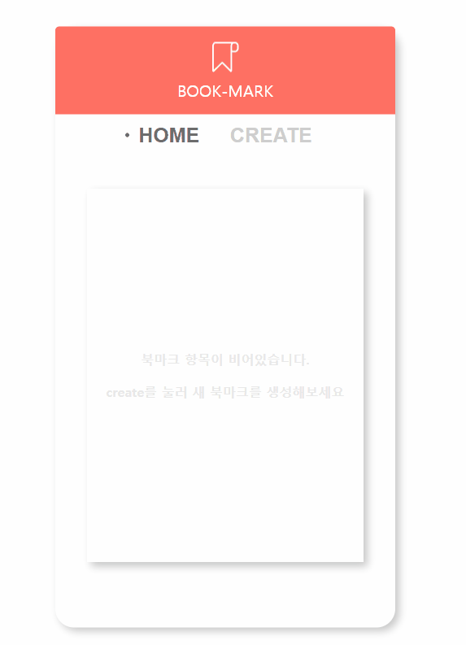
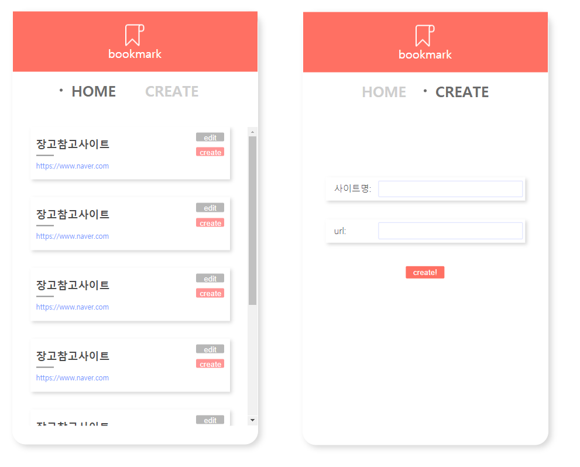

## Django

> 인프런+제코베


### 구현화면

**랜딩 페이지**


**북마크구현_장고**




**북마크구현**




**XD와 Zeplin을 사용하여 UI구성**

### 북마크 구현

**reset.css**

브라우저마다 기본값이 다르기에 모든 브라우저에서 통일된 화면을 보기위해서 기본값을 처음부터 초기화시킨다

```css
body
{
margin:0px;
padding:0px;
}
/*위와 같은 것을 쓰고 시작하는 것과 같다*/
```


**container 가운데 정렬**

```css
  position: absolute;
  left: 50%;
  top: 50%;
  /* 좌우 위아래의 - half */
  /* margin-left: -209px; */
  /* margin-top: -369.5px; */
  /*또는 아래와 같이 사용 */
  transform: translate(-50%, -50%);
```


태그는 블록, 인라인으로 나뉜다

블록은 밑으로 쌓이면서 영역의 좌우 전체를 가지게 된다 -> 따라서 width값이 필요가 없을 수 있다

**header**

```css
  height: 103px;
  background-color: #ff7063;
  font-size: 20px;
  font-weight: 500;
  font-style: normal;
  color: #ffffff;
  display: flex;
  flex-direction: column;
  /* 메인축의 위치를 설정 */
  justify-content: center;
  /* 서브축의 위치를 설정 */
  align-items: center;
```


### 장고 Setting.py

**로그설정**

기본은 True값으로 개발시 로그를 남긴다

```python
# SECURITY WARNING: don't run with debug turned on in production!
DEBUG = True
```


**APP 등록**

```python
# Application definition

INSTALLED_APPS = [
    'django.contrib.admin',
    'django.contrib.auth',
    'django.contrib.contenttypes',
    'django.contrib.sessions',
    'django.contrib.messages',
    'django.contrib.staticfiles',
    'bookmark_django',
]
```


**DB설정**

기본은 sqlite

```python
# Database
# https://docs.djangoproject.com/en/2.1/ref/settings/#databases

DATABASES = {
    'default': {
        'ENGINE': 'django.db.backends.sqlite3',
        'NAME': os.path.join(BASE_DIR, 'db.sqlite3'),
    }
}
```


**정적파일경로**

CSS, JavaScript, Images와 같은 정적 파일 경로를 설정해준다

```python
# Static files (CSS, JavaScript, Images)
# https://docs.djangoproject.com/en/2.1/howto/static-files/

STATIC_URL = '/static/'
```


### 복수의 CSS 템플릿

부모 html을 상속받은 자식 템플릿은 어떻게 따로 css파일을 적용받을 것인가

우선 static 폴더에 자식 템플릿 css 생성해 준다 

```django
app/static/child.css
```

부모의 템플릿의 head에 `` `` ``생성

```html
<!DOCTYPE html>
<html>
<head>
  
  <link rel="stylesheet" href="">
  
  
</head>
...
```

자식 템플릿에서 파일별로 다르게 사용할 수 있는 block이 된다

이후 자식 템플릿 head에서 static 링크 연결

```html

<head> 
  
  
  <link rel="stylesheet" href="">
  
</head>
...
```


### 아나콘다 가상환경설정


### 장고 순서

```python
python manage.py runserver
1. urls.py
2. views.py
3. template
4. models.py
```

python 실행

```python
pip3 install django

#landingpage 라는 프로젝트 생성
django admin startproject landingpage
#
python manage.py migrate
#makemigrations <app-name> -> 마이그레이션 파일 생성, 코드 생성
#migrate <app-name> -> 마이그레이션 적용
python manage.py startapp main
#메인앱을 생성
```

settings.py

```python
ALLOWED_HOSTS = ['*']
#'*'로 변경

#static폴더를 형성하여 front-end 파일이동
STATIC_URL = '/static/'
STATICFILES_DIRS = (
    os.path.join(BASE_DIR, 'static')
)
```

**models.py**

```python
from django.db import models

# Create your models here.
class Post(models.Model):
title = models.CharField(max_length=50)
contetents = models.TextField()
img = models.ImageField()
dataCreat = models.DateTimeField()
category = models. TextField()
```

admin.py

```python
from django.contrib import admin
from .models import Post
# Register your models here.

admin.site.register(Post)
```

이후 terminal에서

```python
#Pillow 설치후
python manage.py makemigrations
python manage.py migrate
python manage.py createsuperuser
python manage.py runserver
#admin으로 접속이 가능하다
```


### 부트스트랩

startbootstrap.com에서 활용

